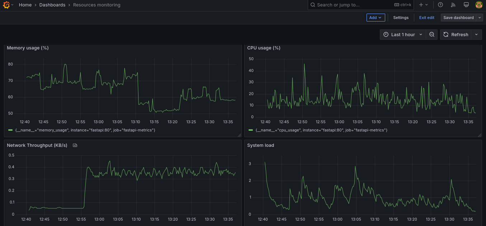
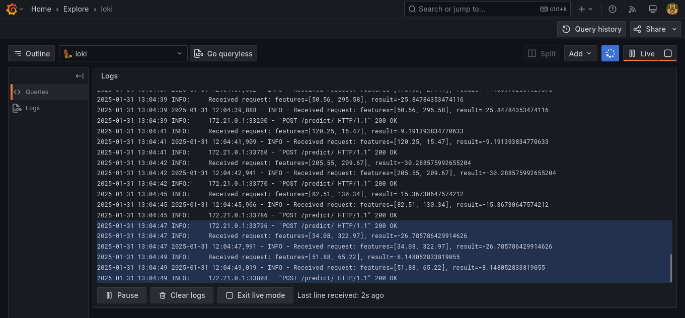
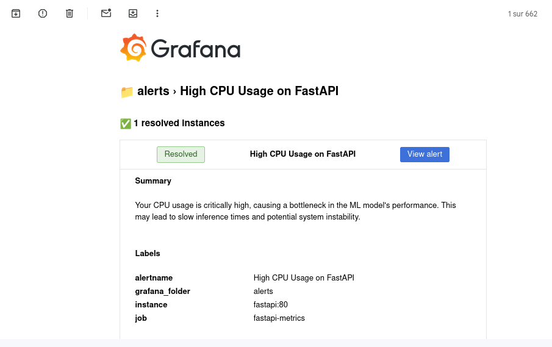

#  ML model monitoring and logging 

## Overview

In our project, we are implementing a monitoring, logging, and alerting system for ML models using Grafana, Prometheus, and Loki. Prometheus collects resource usage metrics such as CPU, memory, and inference latency..etc, while Loki aggregates logs for better traceability. Grafana provides real-time visualization and dashboards, enabling performance analysis and troubleshooting. Additionally, we have configured alerting using Prometheus Alertmanager to notify us of anomalies, such as high latency or resource overuse, via email. This setup ensures efficient observability, proactive issue detection, and optimization of model performance for reliable and scalable deployment.

## Usage

To run the docker containers, execute the following command in the project root:
```
docker-compose up --build
```
Then, to simulate request sending in a real environment, execute the bash script:
```
./simulate_requests.sh
```

This will send requests to the FastAPI server to simulate model inference, while Prometheus scrapes metrics data as time series. At the same time, Loki collects logs. These data will be sent to Grafana at `localhost:3000` after establishing data sources and creating dashboards to facilitate interpretation.

## Resources monitoring


## Logging



## Alerting

